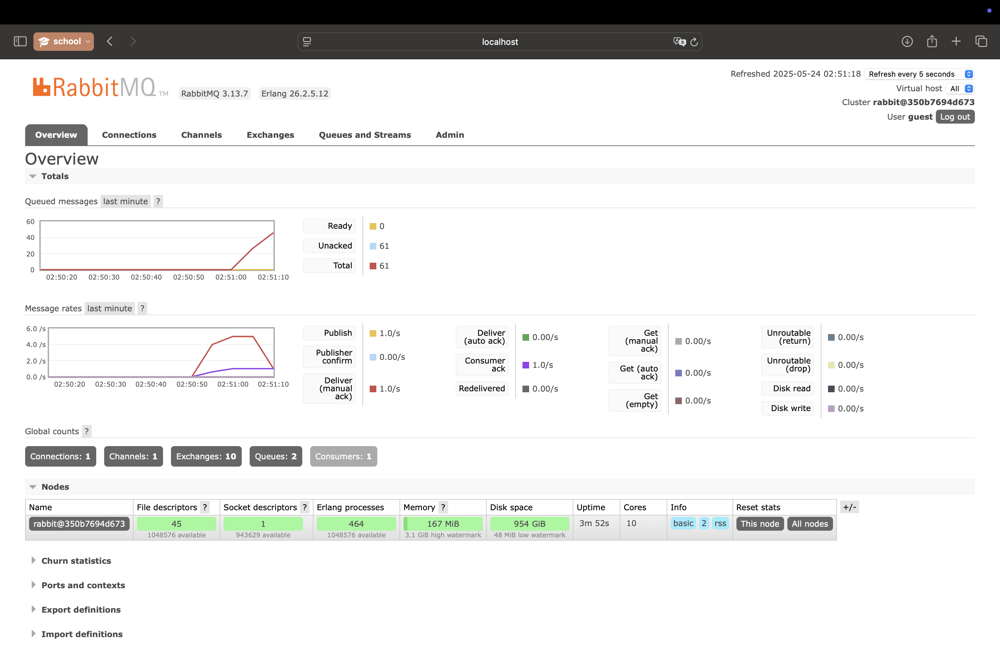

Pemrograman Lanjut (Advanced Programming) 2024/2025 Genap

- Nama : Nashwa Ghania
- NPM : 2306241770
- Kelas : Pemrograman Lanjut - A

### Reflection:
#### 1. What is amqp?
AMQP (Advanced Message Queuing Protocol) adalah protokol komunikasi yang dirancang untuk message-oriented middleware. Ia memungkinkan aplikasi atau sistem yang berbeda untuk bertukar pesan dengan terstruktur, biasanya digunakan dalam arsitektur terdistribusi seperti event-driven systems. AMQP memastikan bahwa pesan yang dikirim dari satu komponen dapat diterima dan diproses oleh komponen lain, bahkan jika keduanya berjalan di waktu atau server yang berbeda. Salah satu implementasi populer dari AMQP adalah RabbitMQ.

####  2. What does it mean? guest:guest@localhost:5672, what is the first guest, and what is the second guest, and what is localhost:5672 is for?
guest:guest@localhost:5672 adalah bagian dari URL koneksi yang digunakan untuk terhubung ke server AMQP (seperti RabbitMQ). Bagian pertama guest:guest adalah kombinasi username dan password; di sini keduanya menggunakan nilai default guest, yang biasanya digunakan saat belum ada konfigurasi autentikasi khusus. localhost menunjukkan bahwa koneksi diarahkan ke server yang berjalan di mesin lokal, sedangkan 5672 adalah port default yang digunakan oleh RabbitMQ untuk menerima koneksi AMQP. Jadi secara keseluruhan, string ini berarti: terhubung ke RabbitMQ yang berjalan secara lokal pada port 5672, menggunakan akun guest dengan password guest.

#### Simulating slow subscriber

Terdapat hingga 61 queue yang tercatat di komputer saya. Saya telah menjalankan publisher sebanyak 15 kali, dan karena pesan yang dikirimkan berlangsung sangat cepat, sementara subscriber tidak dapat menerima pesan dengan cukup cepat akibat adanya jeda waktu (sleep), maka RabbitMQ menyimpan pesan-pesan tersebut terlebih dahulu di dalam antrean.